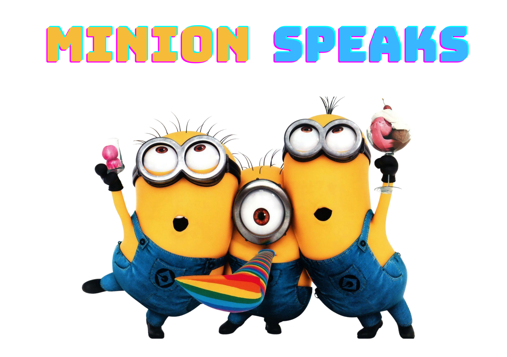
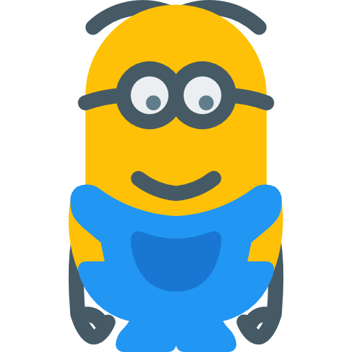
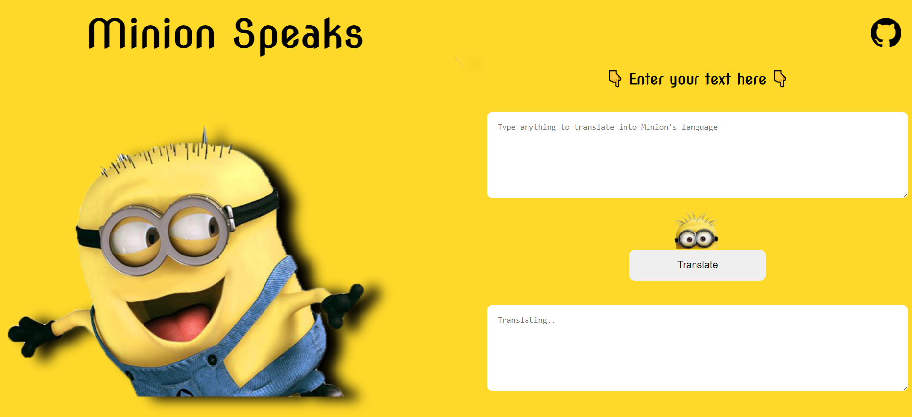
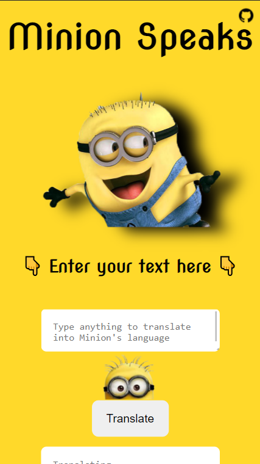

    

## Let's see how Minions speaks! 

### Check out [👉 Live here 👈](https://dcs-minion-speaks.netlify.app/)

### About

The app translates the English language into Minions language (the language they speak).

#### Tech Stack 

 

&nbsp; &nbsp; &nbsp;

